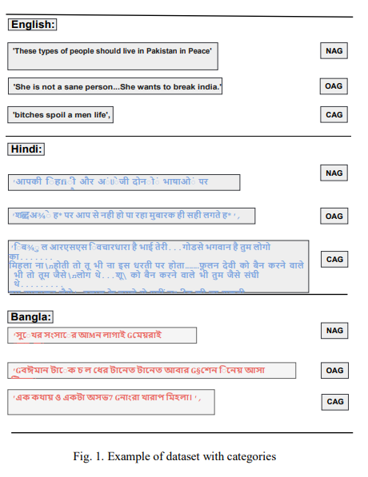

# Aggression-Detection

**Deep Learning Approach for Classifying the 
Aggressive Comments on Social Media: Machine 
Translated Data Vs Real Life Data**

**Abstract**

Aggressive comments on social media negatively 
impact human life. Such offensive contents are responsible for 
depression and suicidal-related activities. Since online social 
networking is increasing day by day, the hate content is also 
increasing. Several investigations have been done on the domain 
of cyberbullying, cyberaggression, hate speech, etc. The majority 
of the inquiry has been done in the English language. Some 
languages (Hindi and Bangla) still lack proper investigations 
due to the lack of a dataset. This paper particularly worked 
on the Hindi, Bangla, and English datasets to detect aggressive 
comments and have shown a novel way of generating machinetranslated data to resolve data unavailability issues. A fully 
machine-translated English dataset has been analyzed with the 
models such as the Long Short term memory model (LSTM), 
Bidirectional Long-short term memory model (BiLSTM), LSTMAutoencoder, word2vec, Bidirectional Encoder Representations 
from Transformers (BERT), and generative pre-trained transformer (GPT-2) to make an observation on how the models 
perform on a machine-translated noisy dataset. We have compared the performance of using the noisy data with two more 
datasets such as raw data, which does not contain any noises, 
and semi-noisy data, which contains a certain amount of noisy 
data. We have classified both the raw and semi-noisy data 
using the aforementioned models. To evaluate the performance 
of the models, we have used evaluation metrics such as F1-score,
accuracy, precision, and recall. We have achieved the highest 
accuracy on raw data using the gpt2 model, semi-noisy data 
using the BERT model, and fully machine-translated data using 
the BERT model. Since many languages do not have proper data 
availability, our approach will help researchers create machine-translated datasets for several analysis purpose. 

**Architecture**

 

**Paper Link**
https://ieeexplore.ieee.org/abstract/document/10020249

**PDF Copy**
https://arxiv.org/ftp/arxiv/papers/2303/2303.07484.pdf

**My Google scholar**
https://scholar.google.com/citations?view_op=list_works&hl=en&hl=en&user=PHg000cAAAAJ

  **Cite Work**

  Bibtex:  
  
  @article{shapna2023deep,
  title={Deep Learning Approach for Classifying the Aggressive Comments on Social Media: Machine Translated Data Vs Real Life Data},
  author={Shapna Akter, Mst and Shahriar, Hossain and Ahmed, Nova and Cuzzocrea, Alfredo},
  journal={arXiv e-prints},
  pages={arXiv--2303},
  year={2023}
}

MLA:

Shapna Akter, Mst, et al. "Deep Learning Approach for Classifying the Aggressive Comments on Social Media: Machine Translated Data Vs Real Life Data." arXiv e-prints (2023): arXiv-2303.

APA:
Akter, M. S., Shahriar, H., Ahmed, N., & Cuzzocrea, A. (2022, December). Deep learning approach for classifying the aggressive comments on social media: Machine translated data vs real life data. In 2022 IEEE International Conference on Big Data (Big Data) (pp. 5646-5655). IEEE.

